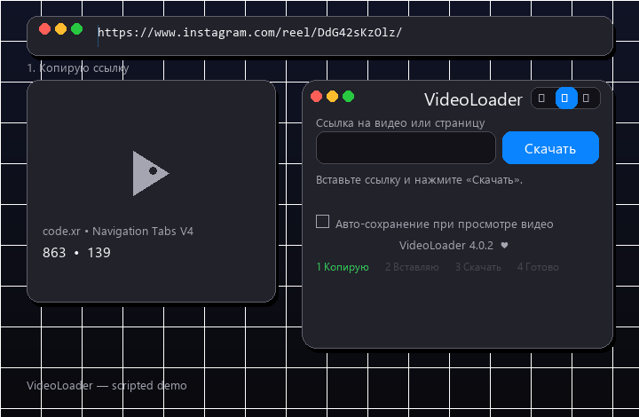

# VideoLoader — качай видео одной кнопкой

Бесплатное расширение для Chrome / Vivaldi / Edge / Brave / Opera / Яндекс Браузера. Без регистрации, без водяных знаков, с открытым кодом.



## ❤️ Поддержать
Если расширение экономит время — [поддержи разработку ♥](https://pay.cloudtips.ru/p/ac545b44).

## Что умеет
- 🎯 **Одна строка + «Скачать»** — вставь ссылку на видео, пост, рилс, TikTok, YouTube.
- 🧠 **Сам ищет цельный файл**: прямой MP4 → данные открытой вкладки → `og:video` → `video_url` → Instagram API → TikTok → embed. Мусор (фрагменты потока) не сохраняет — скажет честно.
- ⚡ **Авто-сохранение** (по умолчанию выкл): смотришь видео — файл сам падает в загрузки. Мелочь и анимации пропускаются.
- 🛑 **Стоп** в любой момент, закрытие окна закачку не прерывает.
- 📜 **Журнал**: последние 7 файлов, «Показать» открывает в папке, ✕ удаляет с диска.
- 🌗 Светлая / тёмная / как в системе, стекло в духе macOS.
- 🖥️ **Локальный помощник** (yt-dlp): то же, что сайты-качалки, но сервер крутится у тебя. Подробности ниже.

## Установка за 1 минуту

**Вариант А — ZIP (проще):**
1. Скачай `videoloader.zip` из раздела [Releases](../../releases) и распакуй.
2. Открой `chrome://extensions/` → включи **«Режим разработчика»**.
3. **«Загрузить распакованное расширение»** → выбери папку `videoloader`.
4. Закрепи иконку на панели. Готово.

**Вариант Б — через командную строку:**
```powershell
git clone https://github.com/askoreebipiatnica-cyber/VideoLoader.git
```
Дальше шаги 2–4 из варианта А с папкой из клона.

Без помощника тоже работает: включи **«Авто-сохранение»**, открой видео, нажми Play — файл сохранится сам.

## Локальный помощник
Сервер на твоей машине (Node + yt-dlp), только `127.0.0.1`:
- `tools\helper\run-helper.bat` — запуск (оставь окно висеть).
- Тянет видео через yt-dlp **с куками твоего Chrome** — доступны и приватные посты.
- Не запущен — расширение молча идёт по встроенной цепочке.
- Готовое складывается в `tools\helper\out`, старше часа чистится само.

## Честные ограничения
- Качается только цельный MP4/WEBM. Нет цельного файла — расширение так и скажет, битый файл не подсунет.
- HLS (`.m3u8`) / DASH (`.mpd`) — плейлисты, а не видео.
- YouTube в топ-качестве отдаёт только DASH — забирается то, что отдаётся цельным.
- Сайты меняют разметку — лечится обновлением.

## Для разработчиков
```powershell
node --check background.js popup.js content.js parser.js
node test/run.mjs    # 73 юнита парсера
node test/chain.mjs  # 31 end-to-end цепочки
```
Иконки: `scripts/make-icons.ps1`. Версия — в `manifest.json`, в окне отображается сама.
